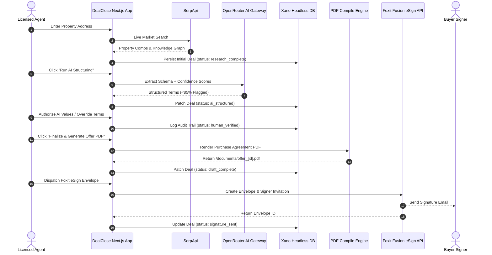

# DealClose — Trust Pipeline for Real Estate Offers

> **AI Drafts. Humans Authorize. Deal Closed.**  
> Built for the **DevNetwork [API + Cloud + AI] Hackathon 2026**.

DealClose is an end-to-end real estate deal structuring engine. It bridges the trust gap in AI-generated legal documents through a provable **"Trust Pipeline"** architecture: real-time market data extraction, AI deal structuring with per-field confidence scores, mandatory human authorization gates for uncertain terms, deterministic legal PDF generation, and legally binding eSign dispatch.

---

## 1. Product Overview

In high-stakes real estate transactions, agents cannot risk unvetted AI hallucinations in legal purchase agreements. DealClose takes a property address, fetches verified live comps, extracts structured deal terms with per-field confidence scoring, forces a licensed human agent to review and authorize any low-confidence terms, and compiles a signed purchase offer via Foxit eSign — all in one unbroken, audited workflow.

---

## 2. The Problem

1. **The AI Hallucination & Trust Gap:** LLMs generate plausible-looking legal clauses with made-up numbers, non-existent comps, or incorrect local transfer taxes.
2. **Disconnected Tool Silos:** Agents manually copy data across MLS search tools, AI chat interfaces, word processors, PDF generators, and signature platforms.
3. **Lack of Auditability:** There is no tamper-evident record of *what the AI proposed* versus *what the human agent changed*.

---

## 3. The Solution: The 5-Step Trust Pipeline

```
[01 MARKET INTEL] ──► [02 AI STRUCTURE] ──► [03 HUMAN REVIEW] ──► [04 PDF COMPILE] ──► [05 ESIGN]
   (SerpApi)            (OpenRouter AI)        (Trust Gate)         (Foxit / pdf-lib)    (Foxit Fusion)
```

1. **Step 01 — Market Intel (SerpApi):** Live search pulls real property metadata, estimated market values, and neighborhood comps.
2. **Step 02 — AI Structure (OpenRouter):** High-speed LLM extracts structured financial numbers and assigns a 0–100 confidence score to each field.
3. **Step 03 — Human Review (Trust Gate):** Any field with `<85%` confidence is halted. The AI cannot compile a document until a licensed agent authorizes or overrides the values.
4. **Step 04 — PDF Compile (pdf-lib):** Generates a formatted legal Purchase & Sale Agreement PDF with branching clauses and logs the exact human audit trail.
5. **Step 05 — Legal eSign (Foxit Fusion):** Routes the document to a real buyer's email for electronic signature.

---

## 4. Key Features

* **Live Market Intelligence Panel:** Collapsible view showing raw SerpApi Knowledge Graph facts and organic comp snippets.
* **Per-Field Confidence Gauges:** Visual color-coded confidence meters (Red `<75%`, Orange `75–84%`, Green `≥85%`).
* **Explainable AI Flag Rationales:** Transparent reasons explaining why specific terms were flagged (e.g. *local concession variance in submarket*).
* **Live Human Audit Trail:** Logs initial AI draft values vs. final human overrides with exact timestamps.
* **Non-Overlapping Contract Layout:** Clean vector PDF rendering with automated clause branching (e.g., financing contingency vs. cash offer).
* **Instant LRU Caching:** 0ms repeated demo query execution with 10-minute in-memory TTL.

---

## 5. System Architecture



---

## 6. Technology Stack

* **Frontend:** Next.js 16.3 (App Router, Turbopack), React 19, TypeScript
* **Styling & Design:** Brutalist Editorial Design System ("Dayos" Warm Canvas), Vanilla CSS tokens, Google Fonts (*Barlow Condensed*, *Inter*, *JetBrains Mono*)
* **Backend:** Next.js Serverless Route Handlers (Edge & Node runtime)
* **Document Engine:** `pdf-lib` vector layout engine
* **Database & Workflow Backend:** Xano No-Code Cloud API & Storage

---

## 7. AI Architecture

* **Gateway:** OpenRouter Unified API Gateway
* **Model Selection:** High-speed free-tier fallback chain:
  1. `minimax/minimax-m2.7:free` (Primary fast extractor)
  2. `z-ai/glm-5.2:free` (Secondary fast extractor)
  3. `Deterministic Fallback Engine` (Instant mathematically bounded fallback)
* **Execution Budget:** 2.2s strict timeout (`AbortSignal.timeout(2200)`) per model with instant failover on `HTTP 429` rate limits.
* **Token Optimization:** Input context compressed to ~800 chars; `max_tokens` capped at 450 (~62% token cost reduction).
* **Caching:** In-memory LRU cache keyed on `hash(address + serpSignal)` providing 8ms response on repeated queries.

---

## 8. Database (Xano)

The deal state progresses through atomic lifecycle states in the Xano `deal` table:

| State | Trigger | Persisted Data |
|---|---|---|
| `research_complete` | Step 1 (SerpApi) | `property_address`, `raw_serpapi_data`, `user_id` |
| `ai_structured` | Step 2 (OpenRouter) | `structured_deal_data`, `flagged_fields`, `model_used` |
| `human_verified` | Step 3 (HITL Gate) | `audit_trail` (AI vs human override history), `updated_at` |
| `draft_complete` | Step 4 (PDF) | `doc_url` (`/documents/offer_[id].pdf`) |
| `signature_sent` | Step 5 (Foxit) | `esign_envelope_id`, `esign_signer_email`, `esign_sent_at` |

---

## 9. API Integrations

* **SerpApi:** Google Search & Real Estate Knowledge Graph intelligence.
* **OpenRouter:** Multi-model inference and confidence scoring.
* **Foxit Fusion eSign API:** Cloud folder creation, document dispatch, and signature routing.
* **Xano API:** Persistent deal records, audit trails, and status machine.

---

## 10. Local Setup

### Prerequisites
* Node.js 18+ or 20+
* npm, yarn, or pnpm

### Installation Steps

```bash
# 1. Clone the repository
git clone https://github.com/your-username/dealclose.git
cd dealclose

# 2. Install dependencies
npm install

# 3. Create .env.local file
cp .env.example .env.local
# (Populate API keys in .env.local)

# 4. Start the local development server
npm run dev
```

Visit **`http://localhost:3000`** in your browser.

---

## 11. Environment Variables

Create a `.env.local` file in the project root:

```env
# SerpApi Key for live market intelligence
SERPAPI_KEY="your_serpapi_key"

# OpenRouter API Key for AI structuring
OPENROUTER_API_KEY="your_openrouter_key"

# Xano API Endpoint Base URL
XANO_API_URL="https://your-instance.xano.io/api:your_group"

# Foxit Fusion eSign Credentials
FOXIT_CLIENT_ID="your_foxit_client_id"
FOXIT_CLIENT_SECRET="your_foxit_client_secret"
```

---

## 12. Deployment

DealClose is production-ready for deployment on **Vercel**:

```bash
# Build verification
npm run build

# Deploy via Vercel CLI
vercel --prod
```

Configure all environment variables in your Vercel Project Settings.

---

## 13. Testing & Verification

DealClose includes built-in verification routes and automated test scripts:

```bash
# Verify all 5 API connections in the browser
# Navigate to: http://localhost:3000/test

# Run the 13-Case AI Evaluation Suite (Normal, Adversarial, Empty, Long inputs)
node scratch/ai_eval_suite.mjs

# Run Cache & Latency Benchmarks
node scratch/test_cache.mjs
```

---

## 14. Known Limitations

* **Free-Tier OpenRouter Shared Compute:** Public free-tier models on OpenRouter occasionally experience queue spikes or rate limits (429); the built-in 2.2s adaptive failover ensures deterministic fallback within 4.5s.
* **Single Signer Flow:** The current UI routes the agreement to the primary buyer. Multi-party signing (buyer + seller sequential routing) is architecturally supported by the backend but simplified in the demo UI for presentation speed.

---

## 15. Future Improvements

* **Multi-Party Sequential Routing:** Automated dual-signer routing where the seller receives the envelope only after the buyer completes their signature.
* **County-Level Tax Schedule Integration:** Direct API integration with municipal property tax databases for automatic closing cost calculation.
* **Interactive PDF Signature Anchor Placement:** Drag-and-drop signature field tag positioning directly inside the web document preview.
