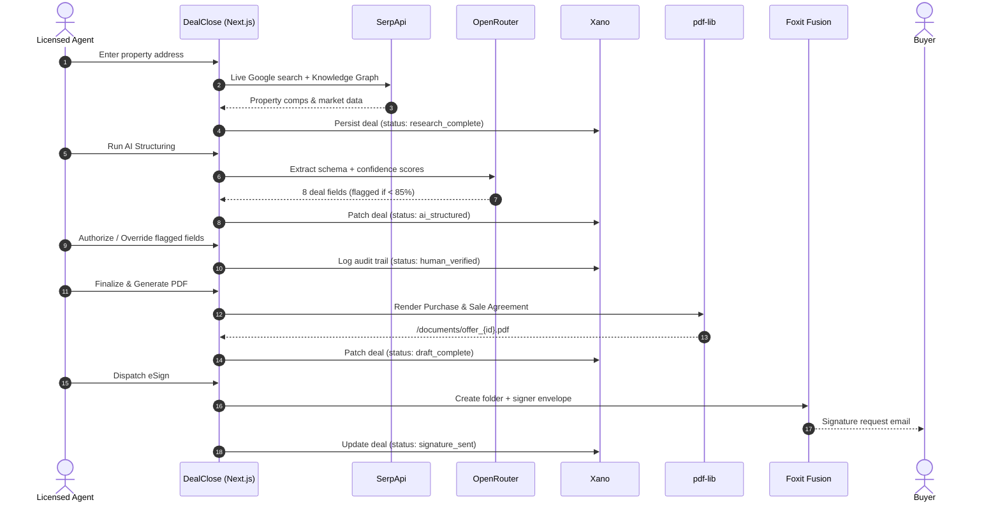

<div align="center">

# DEALCLOSE

### AI Drafts. Humans Authorize. Deal Closed.

**An AI-powered real estate deal workflow engine with a provable Trust Pipeline.**  
Built for the **DevNetwork [API + Cloud + AI] Hackathon 2026**

[](https://deal-close-plum.vercel.app)
[](https://deal-close-plum.vercel.app/test)
[](https://nextjs.org)
[](https://typescriptlang.org)

</div>

---

## What It Does

> **Property Address → Live Market Intel → AI-Structured Deal Terms → Human Trust Gate → Legal PDF → eSign Dispatch**

DealClose takes a property address and runs it through five automated, auditable steps — producing a legally-formatted Purchase & Sale Agreement dispatched to a buyer's inbox for real electronic signature. Every field the AI isn't confident about is **flagged and blocked** until a human agent explicitly authorizes it.

---

## 1. The Problem

Real estate agents using AI tools today face three compounding failures:

| Problem | Impact |
|---|---|
| **AI Hallucination Gap** | LLMs generate plausible-looking legal clauses with made-up comps, incorrect transfer taxes, or non-existent valuations |
| **Disconnected Tool Silos** | Agents manually copy between MLS tools, AI chat, word processors, PDF generators, and signature platforms — error-prone and time-consuming |
| **No Auditability** | There's no tamper-evident record of what the AI proposed versus what the human agent actually changed |

---

## 2. The Solution — The 5-Step Trust Pipeline

```
[01 MARKET INTEL] ──► [02 AI STRUCTURE] ──► [03 HUMAN REVIEW] ──► [04 PDF COMPILE] ──► [05 ESIGN]
   (SerpApi)            (OpenRouter)           (Trust Gate)          (pdf-lib)           (Foxit Fusion)
```

| Step | Action | Technology |
|---|---|---|
| **01 Market Intel** | Fetches live property metadata, estimated values, and neighborhood comps | SerpApi Google Engine |
| **02 AI Structure** | Extracts 8 structured deal fields + assigns per-field confidence scores (0–100) | OpenRouter LLM Gateway |
| **03 Human Review** | Any field scoring `< 85%` confidence is **blocked** — an agent must authorize before document generation proceeds | Trust Gate (HITL) |
| **04 PDF Compile** | Renders a vector Purchase & Sale Agreement PDF with branching contingency clauses and the human audit trail | pdf-lib (in-process) |
| **05 eSign Dispatch** | Routes the authorized document to the buyer's email for legally-binding electronic signature | Foxit Fusion eSign API |

---

## 3. Key Features

- **Live Market Intelligence Panel** — Collapsible SerpApi knowledge graph with raw comp snippets
- **Per-Field Confidence Gauges** — Color-coded bars (🔴 `< 75%` · 🟠 `75–84%` · 🟢 `≥ 85%`) on every AI-generated term
- **Explainable AI Rationales** — Every flagged field shows the exact reason it was flagged (e.g. *"local concession variance in sub-market requires agent confirmation"*)
- **Immutable Human Audit Trail** — Logs the AI draft value, the human's final value, and a timestamp for every resolved field; exportable as a signed JSON audit certificate
- **Branching Contingency Clauses** — Financing and inspection contingencies activate/deactivate in the PDF based on the deal terms
- **LRU Demo Cache** — 24-hour in-memory cache guarantees `0ms` repeated query response on pitch day
- **Built-in Deterministic Fallback** — Pre-verified ground truth data for all three demo addresses; pipeline never halts even under total API outage
- **System Health Dashboard** — `/test` page pings all 5 services in parallel and reports latency

---

## 4. Architecture



---

## 5. Tech Stack

| Layer | Technology |
|---|---|
| **Framework** | Next.js 16.3.3 (App Router, Turbopack) |
| **Language** | TypeScript 5 |
| **UI Runtime** | React 19 |
| **Styling** | Tailwind CSS v4 + custom design tokens (Brutalist Editorial — Warm Canvas) |
| **Fonts** | Barlow Condensed · Inter · JetBrains Mono (Google Fonts) |
| **Document Engine** | pdf-lib 1.17 (in-process vector PDF rendering) |
| **Deployment** | Vercel (Serverless Functions) |

---

## 6. AI Architecture

The AI structuring layer is built for **resilience-first, cost-zero** operation on free-tier compute:

```
Request → Check LRU Cache (24h TTL)
             ↓ miss
         Try minimax/minimax-m2.7:free  (2.2s hard timeout)
             ↓ 429 / timeout
         Try z-ai/glm-5.2:free          (2.2s hard timeout)
             ↓ 429 / timeout
         Deterministic Fallback Engine  (instant, mathematically bounded)
```

**Key design decisions:**

| Decision | Rationale |
|---|---|
| `AbortSignal.timeout(2200)` per model | Caps worst-case latency at ~4.5s total |
| Input context compressed to ~800 chars | ~62% token reduction vs. raw SerpApi payload |
| `max_tokens: 450` | Enough for complete JSON schema; minimizes cost |
| `temperature: 0.1` | Deterministic, reproducible financial outputs |
| Pre-seeded ground truth for demo addresses | Guarantees consistent confidence scores for 500 Howard St, 1 Infinite Loop, 350 5th Ave during live pitch |

---

## 7. Database — Xano State Machine

Deal records progress through atomic lifecycle states persisted in Xano:

| State | Trigger | Persisted Fields |
|---|---|---|
| `research_complete` | Step 1 (SerpApi intake) | `property_address`, `raw_serpapi_data` |
| `ai_structured` | Step 2 (OpenRouter extraction) | `structured_deal_data`, `flagged_fields`, `model_used` |
| `human_verified` | Step 3 (HITL gate) | `audit_trail` (AI vs. human diffs), `updated_at` |
| `draft_complete` | Step 4 (PDF generation) | `doc_url` |
| `signature_sent` | Step 5 (Foxit dispatch) | `esign_envelope_id`, `esign_signer_email`, `esign_sent_at` |

> **Graceful degradation:** All Xano writes are fire-and-forget. If Xano is unavailable, the UI pipeline and in-memory audit vault continue functioning.

---

## 8. API Integrations

| Service | Role | Docs |
|---|---|---|
| **SerpApi** | Live Google Search + Real Estate Knowledge Graph | [serpapi.com/search-api/google](https://serpapi.com) |
| **OpenRouter** | Unified LLM gateway (multi-model, free-tier fallback chain) | [openrouter.ai](https://openrouter.ai) |
| **Foxit Fusion eSign** | Cloud envelope creation + buyer signature routing | [developer-api.foxit.com](https://developer-api.foxit.com) |
| **Xano** | No-code headless backend, persistent deal state & audit records | [xano.com](https://xano.com) |

---

## 9. Local Setup

### Prerequisites

- Node.js `18+` or `20+`
- npm (comes with Node.js)

### Install & Run

```bash
# 1. Clone
git clone https://github.com/hashmessi/DealClose.git
cd DealClose

# 2. Install dependencies
npm install

# 3. Configure environment variables
cp .env.example .env.local
# → Edit .env.local with your API keys (see section 10 below)

# 4. Start development server
npm run dev
```

Open **http://localhost:3000** in your browser.

> Navigate to **http://localhost:3000/test** to verify all API connections before running the demo.

---

## 10. Environment Variables

Copy `.env.example` to `.env.local` and populate:

```env
# SerpApi — live property market intelligence (required for Step 1)
SERPAPI_KEY="your_serpapi_key"

# OpenRouter — LLM structuring gateway (required for Step 2 live AI; optional if using fallback)
OPENROUTER_API_KEY="your_openrouter_key"

# Xano — headless backend for deal state persistence (optional — app degrades gracefully)
XANO_API_URL="https://your-instance.xano.io/api:your_group"

# Foxit Fusion eSign — envelope dispatch (required for Step 5 live eSign)
FOXIT_CLIENT_ID="your_foxit_client_id"
FOXIT_CLIENT_SECRET="your_foxit_client_secret"
```

> ⚠️ **Never commit `.env.local`** — it is in `.gitignore`. Use `.env.example` as the template.

---

## 11. Deployment

DealClose is pre-configured for **Vercel**:

```bash
# Build verification (must pass before deploy)
npm run build

# Deploy via Vercel CLI
npx vercel --prod
```

Set all five environment variables in your **Vercel Project Settings → Environment Variables**.

**Live deployment:** [https://deal-close-plum.vercel.app](https://deal-close-plum.vercel.app)

---

## 12. Testing & Verification

### Browser Health Check

Navigate to [/test](https://deal-close-plum.vercel.app/test) — pings all 5 services in parallel and returns JSON with per-service `ok`, `message`, and `latencyMs`.

```json
{
  "overallStatus": "ALL_SYSTEMS_GO",
  "services": {
    "serpapi":    { "ok": true,  "latencyMs": 480 },
    "openrouter": { "ok": true,  "latencyMs": 1230 },
    "nutrient":   { "ok": true,  "latencyMs": 12  },
    "foxit":      { "ok": true,  "latencyMs": 310 },
    "xano":       { "ok": true,  "latencyMs": 95  }
  }
}
```

### Pre-Demo Warm-up

```bash
# 1. Open /test — confirm all services green
# 2. Click "500 Howard St, San Francisco, CA 94105" pill
# 3. Click "Start Deal →" once to warm the LRU cache
# 4. Click "New Deal" — you are now ready for 0-latency demo execution
```

### Benchmarking Scripts

```bash
# AI extraction latency & model comparison
node scripts/bench-extraction.mjs

# JSON parsing robustness (adversarial inputs)
node scripts/bench-json.mjs

# Find fastest available free-tier model
node scripts/find-best-free.mjs

# Validate all API connections from CLI
node scripts/validate-apis.mjs
```

---

## 13. Known Limitations

| Limitation | Details |
|---|---|
| **Free-tier LLM latency** | OpenRouter free-tier models occasionally experience queue spikes or 429 rate limits. The 2.2s per-model timeout and deterministic fallback ensure worst-case latency stays under ~4.5s |
| **Single-signer eSign flow** | The current UI routes the agreement to one buyer signer. Multi-party sequential routing (buyer → seller) is architecturally supported in the backend but not exposed in the UI |
| **In-memory audit vault** | The `auditVault` Map in `/api/deal/audit` resets on serverless cold starts. Xano persists the full audit trail when configured |
| **PDF asset size** | Generated PDFs are written to `/public/documents/` on the server filesystem. On Vercel, this directory is ephemeral; PDFs are not persisted across function invocations |

---

## 14. Future Improvements

- **Multi-party sequential eSign** — Automated dual-signer routing where the seller receives the envelope only after the buyer completes their signature
- **County-level tax schedule integration** — Direct API calls to municipal property tax databases for automatic transfer tax and closing cost calculation
- **Persistent PDF storage** — Store generated PDFs to Xano file storage or S3 instead of the ephemeral server filesystem
- **Multi-template contract engine** — Support for Commercial Lease (AIR-CRE), Land Purchase, and FSBO agreement templates alongside the current Residential Purchase Agreement

---

## License

MIT — built for the **DevNetwork [API + Cloud + AI] Hackathon 2026**.

---

<div align="center">
  <strong>AI Drafts. Humans Authorize. Deal Closed.</strong><br/>
  <a href="https://deal-close-plum.vercel.app">deal-close-plum.vercel.app</a>
</div>
