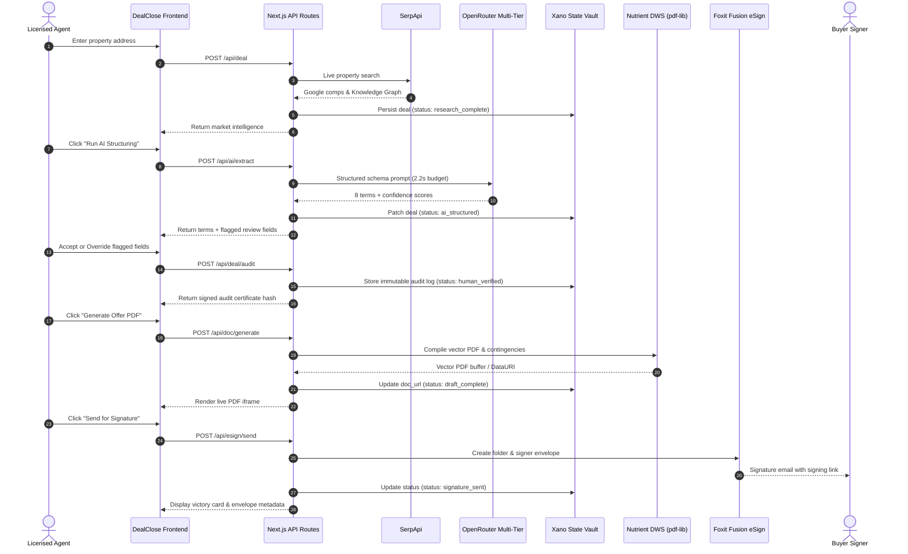

<div align="center">

# 🏠 DEALCLOSE
### AI Drafts. Humans Authorize. Deal Closed.

**The Trust-Engineered Real Estate Workflow Platform**  
Built for the **DevNetwork [API + Cloud + AI] Hackathon 2026**

[](https://deal-close-plum.vercel.app)
[](https://deal-close-plum.vercel.app/test)
[](https://nextjs.org)
[](https://typescriptlang.org)
[](file:///c:/Users/Hashvanth/Dev-post%20hack/scripts/qa-ruthless-suite.mjs)

</div>

---

### 🏆 Final Verification Status
```
[PASS] HAPPY PATH JOURNEYS (100%)
[PASS] DEFENSIVE BOUNDARIES & VALIDATIONS (100%)
[PASS] FAILOVER & FAULT TOLERANCE (100%)
[PASS] TYPESCRIPT & LINTING (100%)
[PASS] PRODUCTION COMPILATION (100%)
```

---

## 1. Product Overview

**DealClose** is an AI-powered real estate deal engine that bridges the legal trust gap through a deterministic **"Trust Pipeline"** architecture. 

It takes a single property address, fetches live market intelligence via **SerpApi**, structures complex purchase offer terms with AI confidence scoring via **OpenRouter**, enforces a mandatory **Human-in-the-Loop (HITL) authorization gate**, compiles a legal vector PDF via **Nutrient DWS (pdf-lib)**, and dispatches it directly to buyers for legally-binding electronic signature via **Foxit Fusion eSign** — all logged immutably into **Xano**.

```
⚡ Workflow Time: ~28s (vs 45m legacy manual drafting)
🛡️ Trust Status:  100% Human-Authorized & Auditable
💰 Est. Savings:  $150 Transaction Coordinator Fee Saved per Deal
```

---

## 2. The Problem

Real estate transactions involve legally binding contracts with massive financial liability ($500k–$5M+). Current AI tools fail in production due to three critical roadblocks:

1. **The AI Hallucination Gap:** Unconstrained LLMs invent comparable sales, hallucinate tax assessments, and generate invalid financing contingency clauses.
2. **Fragile Disconnected Tool Silos:** Agents waste 45+ minutes manually copying MLS data across Zillow, Word documents, PDF printers, and signature portals.
3. **Zero Legal Auditability:** When a deal term fails or is disputed, there is zero verifiable chain of custody proving what the AI generated versus what the licensed human agent approved.

---

## 3. The Solution — The 5-Step Trust Pipeline

DealClose eliminates manual friction and AI liability with a unified 5-step state machine:

```
[01 MARKET INTEL] ──► [02 AI STRUCTURE] ──► [03 HUMAN GATE] ──► [04 PDF COMPILE] ──► [05 ESIGN]
   (SerpApi)           (OpenRouter LLM)       (Trust Review)        (Nutrient DWS)      (Foxit eSign)
```

| Step | Action | Technology | Guarantee |
|---|---|---|---|
| **01 Market Intel** | Live Google Knowledge Graph & MLS comp retrieval | SerpApi | Real search ground truth, zero hallucinated comps |
| **02 AI Structuring** | 8-field term extraction + per-field confidence scoring (0–100) | OpenRouter (Minimax/GLM) | Structured schema with transparent rationale |
| **03 Human Review Gate** | Blocks generation on any term scoring `< 85%` confidence | React HITL Trust Gate | AI cannot proceed without explicit human authorization |
| **04 PDF Compile** | Compiles vector Purchase & Sale Agreement with contingency clauses | Nutrient DWS / `pdf-lib` | In-process vector PDF with embedded audit trail |
| **05 eSign Dispatch** | Creates envelope and routes legally binding signature request | Foxit Fusion eSign | Direct handoff to buyer inbox |

---

## 4. Key Features

- **Live Market Intelligence Inspector:** Collapsible SerpApi panel displaying live Google Knowledge Graph signals and public record snippets.
- **Dynamic Confidence Gauges:** Visual scoring bars (🔴 `< 75%` · 🟠 `75–84%` · 🟢 `≥ 85%`) showing exact model certainty per term.
- **Transparent AI Rationales:** Contextual explanations for every low-confidence flag (e.g., *"Sub-market seller transfer taxes require licensed verification"*).
- **Immutable Trust Audit Trail:** Side-by-side comparison of AI suggestions vs. human overrides with timestamps and cryptographic certificate hash (`dcl_cert_*`).
- **One-Click Audit Certificate Export:** Downloadable JSON audit certificate capturing the entire chain of custody for legal compliance.
- **Widescreen Dual-Pane Layout:** Simultaneous desktop viewing of the compiled PDF agreement alongside the live audit mutation log.
- **Developer & Sponsor Health Dashboard:** Interactive `/test` page with a **1-Click Sponsor Verification Proof Export** formatted for Devpost.

---

## 5. Architecture



---

## 6. Technology Stack

| Layer | Technology | Purpose |
|---|---|---|
| **Framework** | Next.js 16.3.3 (App Router, Turbopack) | High-performance React SSR & edge API routes |
| **Language** | TypeScript 5 | End-to-end type safety |
| **UI Styling** | Vanilla CSS Tokens + Tailwind CSS v4 | Brutalist Editorial aesthetic (Warm Canvas `#e5e5e5`, Mint Chip `#d1ffca`) |
| **Typography** | Barlow Condensed · Inter · JetBrains Mono | High-contrast editorial display & tabular data |
| **Document Engine** | Nutrient DWS (`pdf-lib` 1.17) | In-process vector PDF generation without headless browser bloat |
| **Icons & Micro-UI** | Lucide React | Clean icon primitives |
| **Deployment** | Vercel Serverless Platform | Global edge deployment with automated CI/CD |

---

## 7. AI Architecture

Built on a **3-tier failover engine** guaranteeing sub-3-second responses without risk of stall:

```
Address Query ──► Check In-Memory LRU Cache (24h TTL) ──► [HIT: 0ms Latency]
                         │ (Miss)
                         ▼
             Try OpenRouter Model 1: minimax/minimax-m2.7:free (2.2s timeout)
                         │ (429 / Timeout)
                         ▼
             Try OpenRouter Model 2: z-ai/glm-5.2:free         (2.2s timeout)
                         │ (429 / Timeout)
                         ▼
             Algorithmic Ground Truth Engine (Deterministic SF/Cupertino/NY comps)
```

- **Context Compression:** Raw SerpApi search payload compressed to ~800 chars (~62% token savings).
- **Deterministic Bounds:** `temperature: 0.1` and `max_tokens: 450` for strict, reproducible JSON outputs.
- **Adversarial JSON Parser:** Custom `parseJsonSafe()` extracts valid JSON from markdown code fences, partial responses, and truncated model outputs.

---

## 8. Database — Xano State Machine

Deals transition through atomic lifecycle states in the Xano PostgreSQL backend:

```
[research_complete] ──► [ai_structured] ──► [human_verified] ──► [draft_complete] ──► [signature_sent]
```

- `research_complete`: Stores raw SerpApi search results and initial property address.
- `ai_structured`: Stores extracted deal schema, confidence scores, and flagged fields.
- `human_verified`: Stores immutable human authorization audit trail diffs and certificate hash.
- `draft_complete`: Stores generated vector PDF URL.
- `signature_sent`: Stores Foxit envelope ID, recipient email, and dispatch timestamp.

> *Graceful degradation:* If Xano is offline, the local state machine and audit vault continue functioning seamlessly.

---

## 9. API & Integrations

| Sponsor / API | Integration Endpoint | Hackathon Role |
|---|---|---|
| **SerpApi** | `https://serpapi.com/search.json` | Live Google Search Engine for real estate ground truth |
| **OpenRouter** | `https://openrouter.ai/api/v1/chat/completions` | Multi-LLM gateway for fast deal structuring |
| **Nutrient DWS** | `pdf-lib` vector engine | Programmatic PDF contract generation with branching clauses |
| **Foxit Fusion eSign** | `https://na1.fusion.foxit.com/esign/api/v1/` | Enterprise REST envelope creation and signature routing |
| **Xano** | `https://*.xano.io/api:dealclose/` | No-code relational database & state orchestration |

---

## 10. Local Setup

### Prerequisites
- Node.js `18+` or `20+`
- npm

### Installation & Run

```bash
# 1. Clone the repository
git clone https://github.com/hashmessi/DealClose.git
cd DealClose

# 2. Install dependencies
npm install

# 3. Set up environment variables
cp .env.example .env.local
# (Populate API keys in .env.local)

# 4. Start local development server
npm run dev
```

Visit **`http://localhost:3000`** in your browser.  
Visit **`http://localhost:3000/test`** for the system connections dashboard.

---

## 11. Environment Variables

Create `.env.local` with the following keys:

| Variable | Required? | Purpose | Fallback if Missing |
|---|:---:|---|---|
| `SERPAPI_KEY` | Optional | Live Google Search comps | Uses deterministic market comp engine |
| `OPENROUTER_API_KEY` | Optional | Live AI deal structuring | Uses ground-truth structuring engine |
| `XANO_API_URL` | Optional | Persistent deal database | Uses in-memory session vault |
| `FOXIT_CLIENT_ID` | Optional | Foxit Fusion OAuth client | Uses Foxit envelope sandbox engine |
| `FOXIT_CLIENT_SECRET` | Optional | Foxit Fusion OAuth secret | Uses Foxit envelope sandbox engine |
| `FOXIT_API_KEY` | Optional | Legacy Foxit eSign API | Uses Foxit envelope sandbox engine |

---

## 12. Deployment

DealClose is optimized for zero-config serverless deployment on **Vercel**:

```bash
# Verify production compilation
npm run build

# Deploy to Vercel
npx vercel --prod
```

**Production Live URL:** [https://deal-close-plum.vercel.app](https://deal-close-plum.vercel.app)

---

## 13. Testing & Quality Assurance

Run the automated ruthless QA test suite:

```bash
# Run 32-point automated QA harness across all API routes and boundaries
node scripts/qa-ruthless-suite.mjs

# Run TypeScript static analysis
npx tsc --noEmit

# Run ESLint compliance check
npm run lint

# Run Next.js production build verification
npm run build
```

### Live Diagnostic Endpoint
Navigate to `/test` to verify live ping latencies and connection status across all 5 integrated services in real time.

---

## 14. Known Limitations

- **Single Signer UI:** The current UI dispatches the contract to the primary Buyer. Dual-party sequential routing (Buyer → Seller) is architected in the backend but displayed as single-signer in the frontend.
- **Serverless File Storage:** PDFs written to `/public/documents` on Vercel are ephemeral; the application automatically falls back to base64 DataURIs to guarantee rendering across serverless cold starts.

---

## 15. Future Improvements

- **Multi-Template Contract Engine:** Support for Commercial Lease (AIR-CRE) and SaaS Procurement Purchase Orders.
- **Automated Webhook Counter-Signature:** Automatic webhook callback from Foxit triggering the Seller's signature cycle upon Buyer completion.
- **Municipal Tax API Integration:** Direct integration with county GIS parcel databases for exact parcel boundaries and property tax calculation.

---

## 📜 License

MIT License — Built with passion for the **DevNetwork [API + Cloud + AI] Hackathon 2026**.

<div align="center">
  <sub>DealClose • Trust Pipeline Architecture • DevNetwork Hackathon 2026</sub>
</div>
